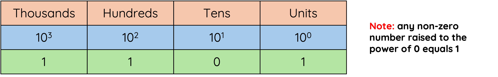
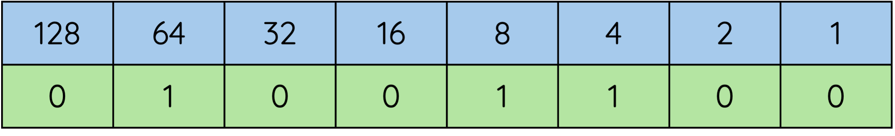

# Number Representation

We use the Decimal number system to represent the numbers we think about and work with.  Decimal is base 10 meaning we have 10 digits, 0 – 9 (start counting at zero!).  Think about how the positioning of the number can affect its value.

<figure markdown="span">
      { width="800" }
</figure>

Binary numbers also have their own mathematical system which is base 2 (0, 1) and can be used to represent Positive Integer numbers.

<figure markdown="span">
      { width="800" }
</figure>

## Binary to Decimal Conversion

To convert a Binary number into Decimal we need to remember the conversion table.  

A good way to remember the bit values is that it starts with a 1 over the right most bit and doubles each time.

<figure markdown="span">
      { width="500" }
</figure>  

**Add all the parts that have a 1 above them together to get the Decimal version of the number.**

In the exam you will have to remember the rule on how to write the conversion table above the binary number.  

!!! warning "Note"

      Take time with the basic arithmetic, show your working and re-check your final answer.

## Decimal to Binary Conversion

The conversion table shows the value of each Bit as their position moves to the left similar to our decimal units/tens/hundreds.

Now that we know the decimal equivalent to the base two system we can use a simple table to help convert a number into binary.

For example, lets convert the number 76 to binary. 

All we need to do is start at the left of the table and see if we can take away the number without going below 0.

1. Can we take 128 away from 76? No. So we put a 0 inside that box.
2. Can we take 64 away from 76? Yes. So we put a 1 in there. We now have 12 left (76-64=12)
3. Can we take 32 away from 12? No. So we put a 0 in there.
4. Can we take 16 away from 12? No. So we put a 0 in there.
5. Can we take 8 away from 12? Yes. So we put a 1 in there. We now have 4 left (12 - 8 = 4)
6. Can we take 4 away from 4? Yes. So we put a 1 in there. We now have 0 left (4 – 4 = 0)
7. As we are now at 0 we fill the remaining boxes in with 0.

<figure markdown="span">
      { width="500" }
</figure>  

**So the number 76 is represented in binary as '01001100'**

## Advantages of Using Binary Numbers

1. Binary is a simple two-state system (1 or 0) which is ideal when representing a two state system of power on/power off

2. There are only a few rules for addition, making calculations simpler.

3. A degraded signal can still be detected as representing 1.
