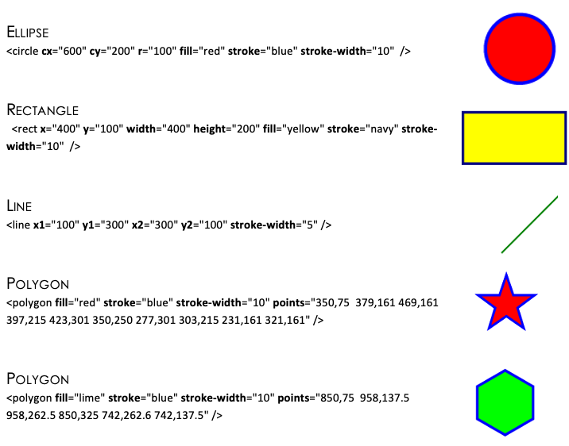

# STORING GRAPHICS

A pixel is the most basic component of any computer graphic. Pixel stands for picture element. 

It corresponds to the smallest element that can be drawn on a computer screen. Every computer graphic is made up of a grid of pixels. When these pixels are painted onto the screen, they form an image.

<figure markdown="span">
      { width="500" }
</figure>

The picture above shows when zoomed into the woman’s eye you can see lots of little blocks. 

**These are pixels.** 

Each pixel stores a separate colour. Today’s cameras take high-resolution photographs that store thousands of pixels, which create a great clear image. 

The above image would be stored as a grid of pixels. Each pixel would also have its own a binary value.

# Storing Black and White Graphics

<figure markdown="span">
      { width="500" }
</figure>

The above graphic is a really simple black and white image saying “HI”. This image is displayed in a 8 x 8 grid table with each box represents a pixel. 

In black and white, each pixel can be represented by 1 bit: 1 if the pixel is black or 0 if the pixel is white. The computer represents the image in memory as a file of 0s and 1s. 

The computer opens this file then starts looking for numbers that describe image information. Every time it comes to a 0 it draws a white pixel. When it comes to a 1 it draws a black pixel. 

The file is known as a bit map. 

In the 8 x 8 bit-mapped grid above each pixel requires 1 bit of storage. 

There are 64 pixels so this means the image needs 64 bits or 8 bytes of storage (8 bits = 1 byte). 

!!! note

    **Graphics tend to be much larger than this simple example.**

# Storing Vector Graphics

In a program such as Serif or Photoshop the computer stores information about an object by its attributes i.e., a description of how it is to be drawn.  

For a rectangle these attributes might be x and y position, height, width, thickness and colour of the lines, colour fill etc. 

This means that the rectangle can be selected at any later time and altered by changing its length, dragging it to a new position etc.  

Though the image on the screen is still stored as a bitmap, the drawing package stores the attributes for each object (rectangle, line, circle, ellipse, text etc.) that is drawn. 

When the drawing is saved, only the list of objects and their attributes is stored which greatly reduces the file size.  

When the drawing is loaded the drawing package redraws all the objects.  This means that if you increase the resolution of the screen the object will remain clear and crisp.

### How Vector Graphics are Stored

The attributes are shown in bold, their values come immediately after the = sign.

<figure markdown="span">
      { width="800" }
</figure>
