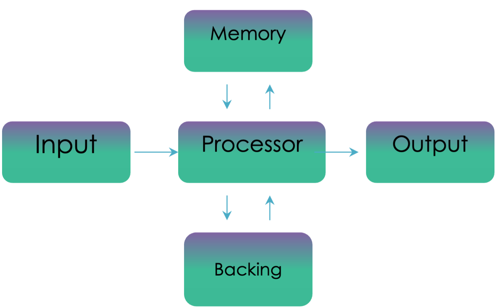
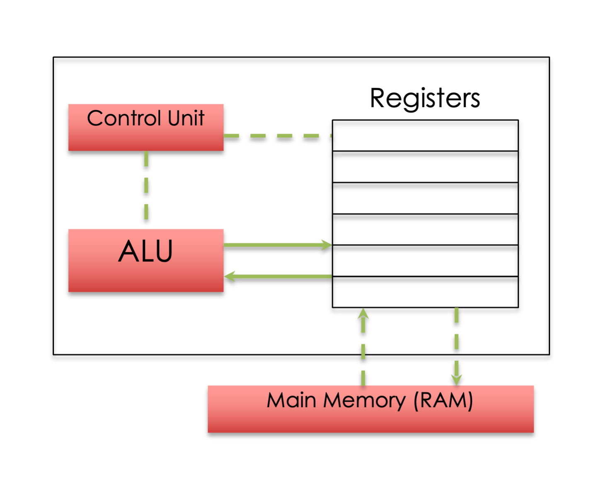
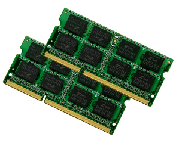
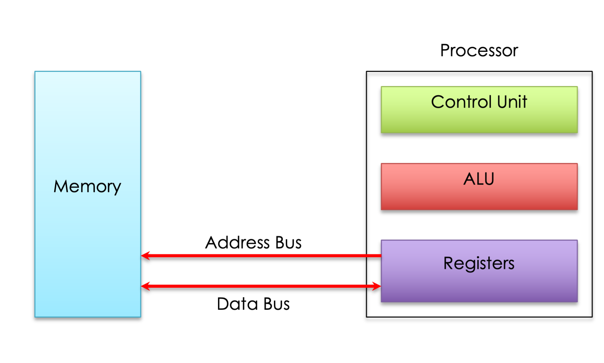

# Computer Architecture

This is a simple representation of how a computer works.

<figure markdown="span">
      { width="800" }
</figure>

## The Processor (CPU) 

<figure markdown="span">
      { width="400" }
</figure>

The processor is the brains of the computer and deals with all the movement of data and any calculations to be carried out. 

Computers can carry out instructions very quickly because the CPU can process billions of instructions every second although it only does one at a time. 

The processor is made up from: 

* The Control Unit (CU) 

* The Arithmetic and Logic Unit (ALU) 

* Registers

### The Control Unit (CU)

* Sends out signals that fetch instructions from the main memory

* To understand these instructions

* Carry out the instructions that are fetched from main memory

In short, the control unit is responsible for running programs that are loaded into main memory.

### The Arithmetic and Logic Unit (ALU)

* Carries out computers arithmetical functions such as addition, subtraction, multiplication etc

* Carries out the computers logical functions such as comparing values using IF, AND, >, <, WHILE

### Registers

* Registers are small temporary memory locations located on the processor. They are used to store the data for the current instruction being processed.

## Main Memory (RAM and ROM)

<figure markdown="span">
      { width="400" }
</figure>

People often get confused between main memory and backing storage, they are not the same. 

**Main memory** is located inside the computer system. 

It can either be **RAM or ROM**. 

Backing storage is **outside the main processor**, e.g. Hard Drives, CD/DVD drives, USB Flash Memory (Pen Drives). 

Main memory in today’s computers is on average around 4-16 Gb of RAM. 

Backing Storage is much bigger with average computers having around 500 Gb or more. 

### ROM (Read only Memory)

ROM is used to store a small part of the operating system called the bootstrap loader.

* Data is stored permanently in ROM

* Data is not lost when the power goes off

* Data in ROM cannot be changed

### RAM (Random Access Memory) 

This is where the operating system is stored; it also holds all programs and data. 

You can purchase additional RAM chips and install them in your desktop computer, which normally speeds up multi-tasking.

* The processor can write to and read from RAM at high speed

* Data held in RAM can be changed

* All data in RAM is lost when the power is switched off

## Buses

<figure markdown="span">
      { width="800" }
</figure>

The Processor (CPU) has buses. 

These are multiple lines that connect the processor and main memory and used to transfer data and send signals between them.

### Address Bus

The Address Bus is used to specify the address of the memory location that is to be read from or written to. 

The bus is uni-directional (one way).  

The address bus is made up of parallel wires each carrying a single bit.  

The size of the address bus will determine how many memory locations can be directly accessed, 
2   = Number of Unique addresses possible 

Modern computers will typically have an address bus 32 lines wide although 64-bit address buses are now becoming normal in everyday computers.

### Data Bus

This bus is used to transfer data between main memory and the processor. 

It is bi-directional (two way) since data can be transferred from a memory location and vice versa.
