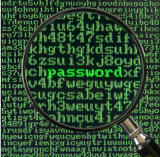
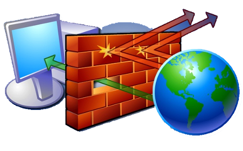

# Security Precautions

## Encryption

<figure markdown="span">
      { width="200" }
</figure>

Encryption means to scramble a message in such a way that only the people who are meant to read it can do so. 

A message sent 'in the clear' looks like:

**"This is a message anyone can read"**

and the encrypted message looks like gibberish:

**fu11^&$$HHPPHDYhg&&£--20dkmama@()@88787399(&*&))OJKK@_D**

Encryption works by both people making use of a secret `key` that only they know (or at least their computers know). 

The original message is mixed in with the key to create a secret message. 

This is done by some very crafty mathematics so that it is very very hard for someone to crack the code - very powerful computers working for a long time would be needed to crack a good code.

## Firewalls

<figure markdown="span">
      { width="300" }
</figure>

A firewall is designed to help protect a computer network from intruders. It does this by controlling what data can and cannot pass through it. 

A firewall can either be:

* A piece of software e.g. Windows has a built in Firewall, Zone Alarm is a free firewall or you can purchase commercial software firewalls.

* A piece of hardware. These boxes are much faster than the software version but they are also much more expensive and tricky to set up.

You would expect home networks to be protected by a software firewall but a large corporation would have several layers of hardware firewalls protecting their networks as well as intruder detection software applications looking for odd behaviour on their networks. 

In short, the more valuable or sensitive the information, the higher the level of protection expected. 
