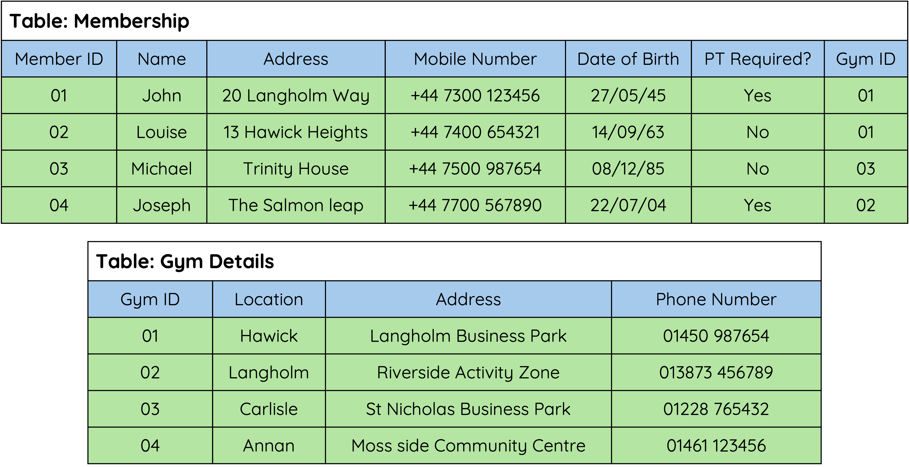

# Relational Databases

## Explanation

### Relational Databases

A relational database consists of two or more tables that are linked through relationships between their data sets.

!!! note 
    When designing your database the words `Table`and`Field` are refered to as `Entities` and `Attrbutes`. It is important that you remember this difference as it often causes confusion when it comes to actually building your database.

<figure markdown="span">
{ width="700" }
<figcaption></figcaption>
</figure>

### Fields

An `Field` holds one piece of data at a time - e.g. a person’s name, age or phone number.

<figure markdown="span">
  { width="700" }
  <figcaption></figcaption>
</figure>

### Records

A `Record` holds a complete set of data.

<figure markdown="span">
  { width="700" }
  <figcaption></figcaption>
</figure>

!!! info "Advantages of Using a Relational Database"

    * Avoids data duplication.
    * Complex queries can be carried out on multiple tables.
    * Easier to maintain security.
    * Easier to change/update data.

