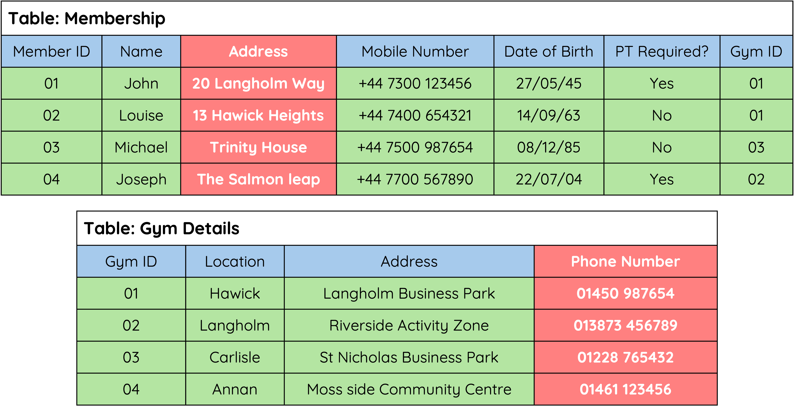
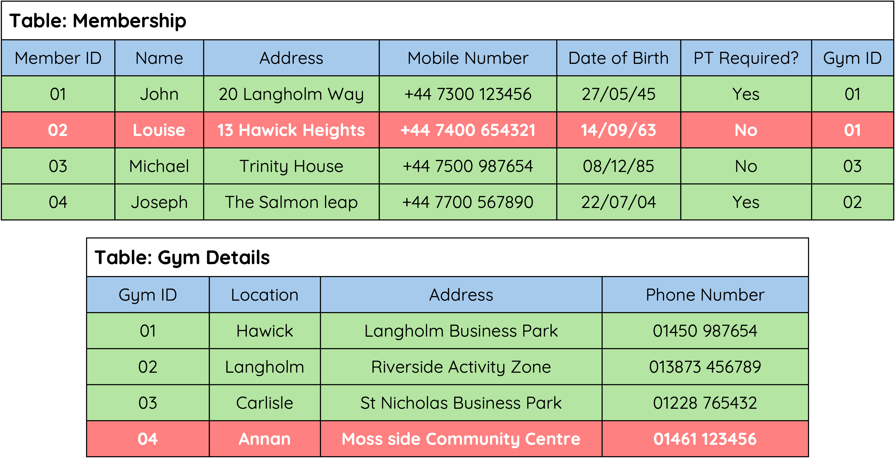

# Relational Databases

## Explanation

A relational database consists of two or more tables that are linked through relationships between their data sets.

When working with multiple tables, records are referred to as entities, with each entity containing multiple attributes and records.

<figure markdown="span">
{ width="700" }
<figcaption></figcaption>
</figure>

## Attributes

An Attribute holds one piece of data at a time - e.g. a person’s name, age or phone number.

<figure markdown="span">
  { width="700" }
  <figcaption></figcaption>
</figure>

## Records

A record holds a complete set of data.

<figure markdown="span">
  { width="700" }
  <figcaption></figcaption>
</figure>

!!! info "ADVANTAGES OF USING A RELATIONAL DATABASE"

    * Avoids data duplication.
    * Complex queries can be carried out on multiple tables.
    * Easier to maintain security.
    * Easier to change/update data.