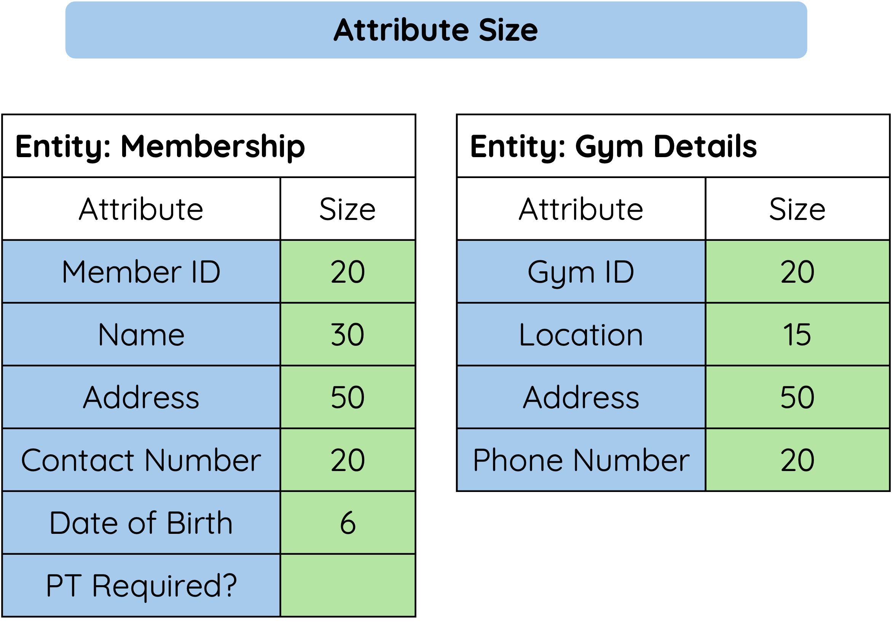
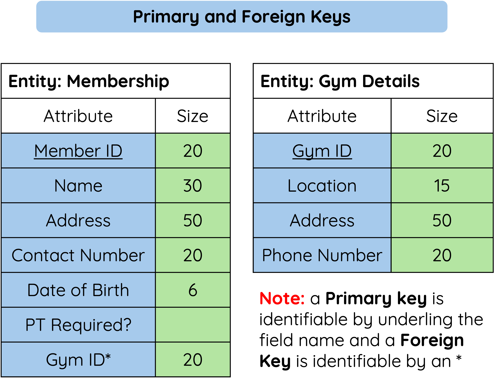
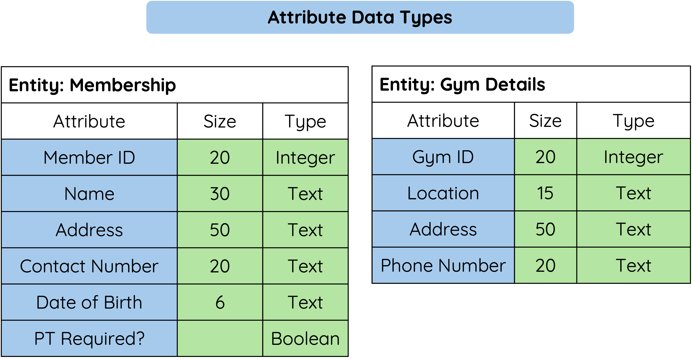
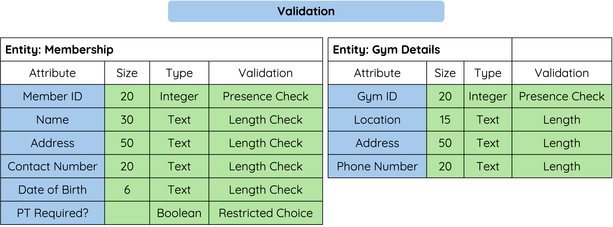

# Data Dictionaries

## Explanation

A data dictionary is a structured document that describes the data in a database. It provides details about each field in a table, helping database designers and users understand how the data is stored and used.

## Why is a Data Dictionary Important?

* Ensures consistency in data entry and structure.
* Helps developers and database administrators understand the database.
* Reduces errors by clearly defining field requirements.
* Supports efficient database design and maintenance.

## Key Elements of a Data Dictionary

==Each field in a table is described using the following properties:==

### - Attribute Size

The size of an attribute refers to the amount of data it can store. It is important to set an appropriate size to optimize database performance and storage.

* Text fields have a maximum number of characters (e.g., First_Name: 20 characters).
* Integer fields have a defined range (e.g., Student_ID: 6 digits).
* Date fields must follow a standard format (e.g., DD/MM/YYYY).
* Boolean fields are limited to two possible values (True/False).
* Choosing the right size ensures efficient storage and prevents data truncation or unnecessary space usage.

<figure markdown="span">
{ width="450" }
<figcaption></figcaption>
</figure>

### - Primary and Foreign Keys

In relational databases, keys help establish relationships between tables:

* Primary Key (PK) – A unique identifier for each record in a table. No two records can have the same primary key. (Example: Student_ID in the Students table)

* Foreign Key (FK) – A field that links to the primary key in another table to create a relationship. (Example: Class_ID in the Students table, which links to Class_ID in the Classes table)

==These keys ensure data integrity and help prevent duplication.==

<figure markdown="span">
{ width="450" }
<figcaption></figcaption>
</figure>

### - Attribute Data Types

* Text (String) – Used for words or characters (e.g., names, addresses).
* Integer (Number) – Whole numbers (e.g., Student ID, Age).
* Decimal (Float) – Numbers with decimal points (e.g., Price, GPA).
* Boolean – True or False values (e.g., Enrolled: Yes/No).
* Date/Time – Stores date and time values (e.g., Date of Birth).

<figure markdown="span">
{ width="550" }
<figcaption></figcaption>
</figure>

### - Validation

Validation is used to ensure that only correct and meaningful data is entered into the database. It helps reduce errors and improves data quality. Common validation types include:

* Presence Check – Ensures that a field is not left empty (e.g., Student_ID cannot be blank).
* Range Check – Ensures a value falls within a specific range (e.g., Age must be between 11 and 18 for a school database).
* Length Check – Ensures text fields are not too short or too long (e.g., Postcodes must be exactly 6-8 characters).
* Restricted Choice - Ensures that the value entered in a field must be selected from a predefined list of acceptable options. 

<figure markdown="span">
{ width="750" }
<figcaption></figcaption>
</figure>
