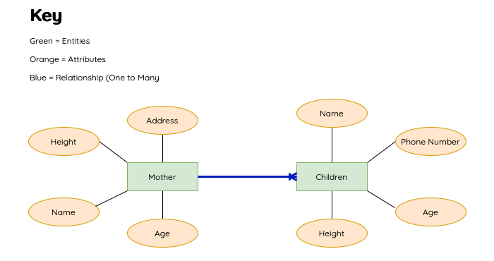

# Database Relationships (One to Many)

Database relationships can be shown in the form of a diagram. 

This diagram is known as an 'entity relationship diagram'. 

As part of your exam, you will have to either draw or interpret one of these diagrams. 

A one-to-many relationship is the most common type of relationship between database entities. In this type of relationship, a row in table A can have many matching rows in table B, but a row in table B can have only one matching row in table A. 

For example, the publishers and titles tables have a one-to-many relationship: each publisher produces many titles, but each title comes from only one publisher.

Think about a mother and her children. A mother can have many children. A child can have only one mother. 

<figure markdown="span">
  { width="500" }
</figure>

Dog Walkers is a company that walks dogs when their owners are at work. The company has a database to store details of the dogs, their owners and the walkers. The data is stored in the following tables.

<figure markdown="span">
  { width="800" }
</figure>

The one-to-many relationships that exist between the tables are:

* Walker and Walk - there is only one walker to many walks. For example, a dog walker can do many different walks.

* Dog and Walk - there is one dog to many walks. For example, one dog can go on many different walks.

* Owner and Dog - there is one owner to many dogs. For example, one owner may have many different dogs.

==Mother and Child Full Example==

<figure markdown="span">
  { width="800" }
</figure>