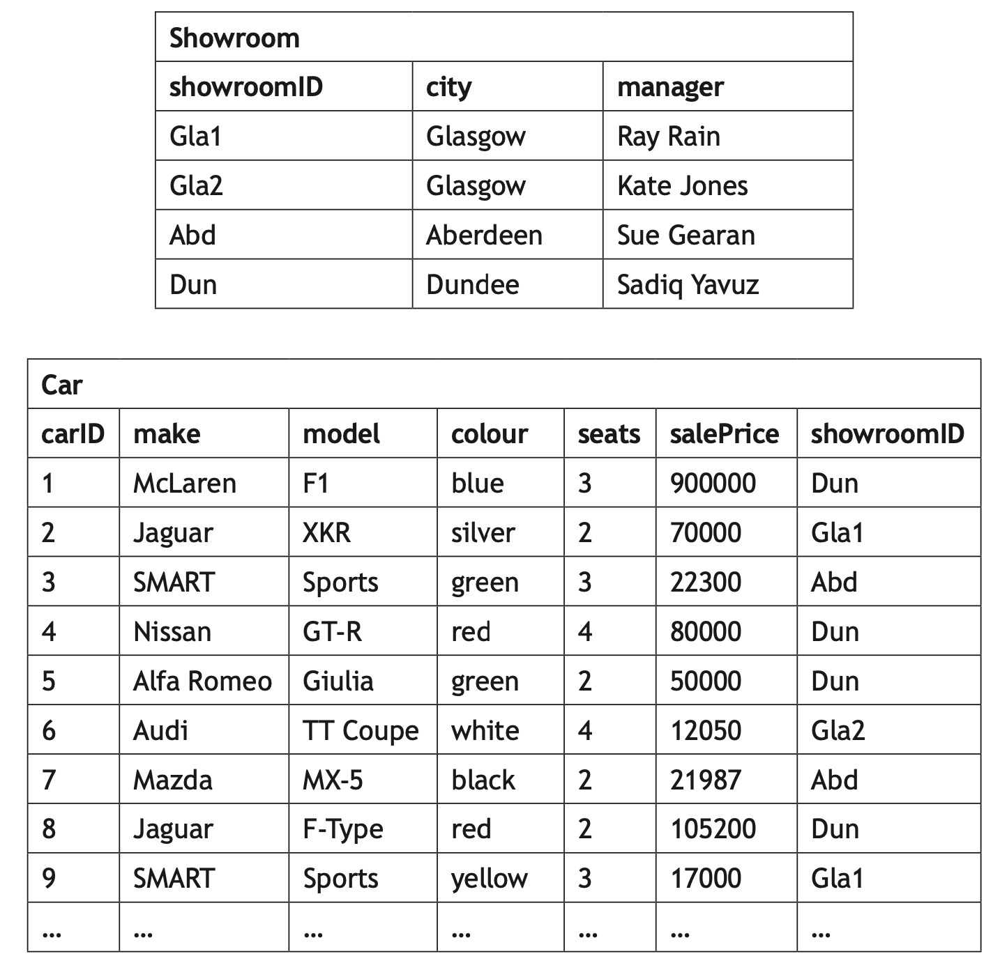
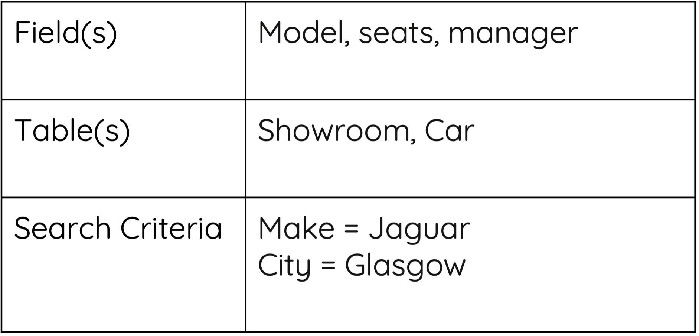

# Query Design

## Understanding the Problem

Before designing a query, you must first make sure you understand the question being asked. For example:

* What information do you need? (e.g., student names and grades)
* Which table(s) contain the required data?
* Do you need to filter, sort, or combine data?

## Identifying the Required SQL Commands

To design a query effectively, you must know the key SQL commands:

### SELECT ... FROM ...

The `SELECT` statement specifies which columns to display, while `FROM` indicates the table where the data is stored.

### WHERE (Filtering Data)

Use the WHERE clause to filter results based on a condition.

### ORDER BY (Sorting Data)

To arrange the results in `ascending (ASC)` or `descending (DESC)` order, use `ORDER BY`.

### UPDATE - Modifying Data

Use UPDATE to change existing records.

### DELETE - Removing Data

Use DELETE to remove specific records.

## Example Question 

<figure markdown="span">
  { width="400" }
  <figcaption></figcaption>
</figure>

!!! question 

    Design a query that would output the model, number of seats and the showroom manager for all the Jaguar cars located in Glasgow.

### Answer

<figure markdown="span">
  { width="400" }
  <figcaption></figcaption>
</figure>