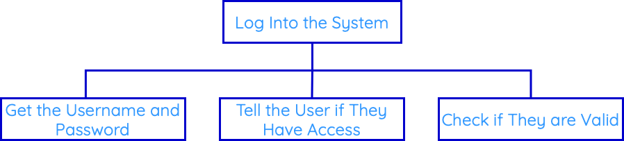

# Structure Diagrams

A structure diagram (or structure chart) is the first design notation. ==We use these to break down the task into smaller chunks==.

The structure diagram is useful for showing the sequence of steps needed to solve the problem. It is always read from top-to-bottom and left-to-right.

??? example "Example 1"

    > You have been asked to create a program that asks for the user’s username and password, checks if they are correct, and tells them whether or not they have been granted access.
    
    * We start with the main task/problem, and put this in the top box.
    
    * We can break the structure diagram into roughly three parts: the `inputs`, the `process` and the `outputs`.
    
    These have to be done in order from left to right:
    
    1. Get the username and password
    2. Check if they are valid
    3. Tell the user if they have access

    <figure markdown="span">
      { width="600" }
      <figcaption></figcaption>
    </figure>
    
    We can break this diagram down further. 
    
    The first step (get the username and password) can be broken down into two more blocks: 
    
    * get the username
      
    * get the password

??? example "Example 2"

    > You have been asked to create a program that asks for two numbers, calculates the total and displays the total on screen.
    
    * We start with the main task/problem, and put this in the top box.
    
    * We can break the structure diagram into roughly three parts: the `inputs`, the `process` and the `outputs`.
    
    These have to be done in order from left to right:
    
    1. Get the two numbers
    2. Calculate the total
    3. Display the total on screen

    <figure markdown="span">
      { width="300" }
      <figcaption></figcaption>
    </figure>

So far, you structure diagrams have used the same symbol (==process, meaning it does something==).

There are four different symbols that can be used on a structure diagram.

<figure markdown="span">
  { width="300" }
  <figcaption></figcaption>
</figure>

??? example "Example 3"

    > You have been asked to create a program that asks for five numbers, calculates the total and displays the total on screen.
    
    * We start with the main task/problem, and put this in the top box.
    
    * We can break the structure diagram into roughly three parts: the `inputs`, the `process` and the `outputs`.
    
    These have to be done in order from left to right:
    
    1. Get the five numbers
    2. Calculate the total
    3. Display the total on screen

    <figure markdown="span">
      { width="300" }
      <figcaption></figcaption>
    </figure>
