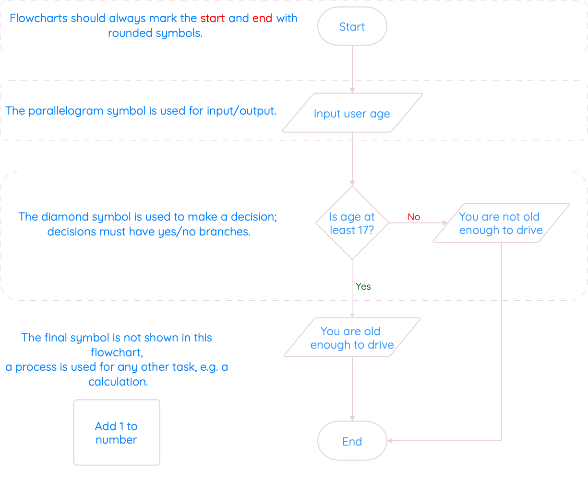
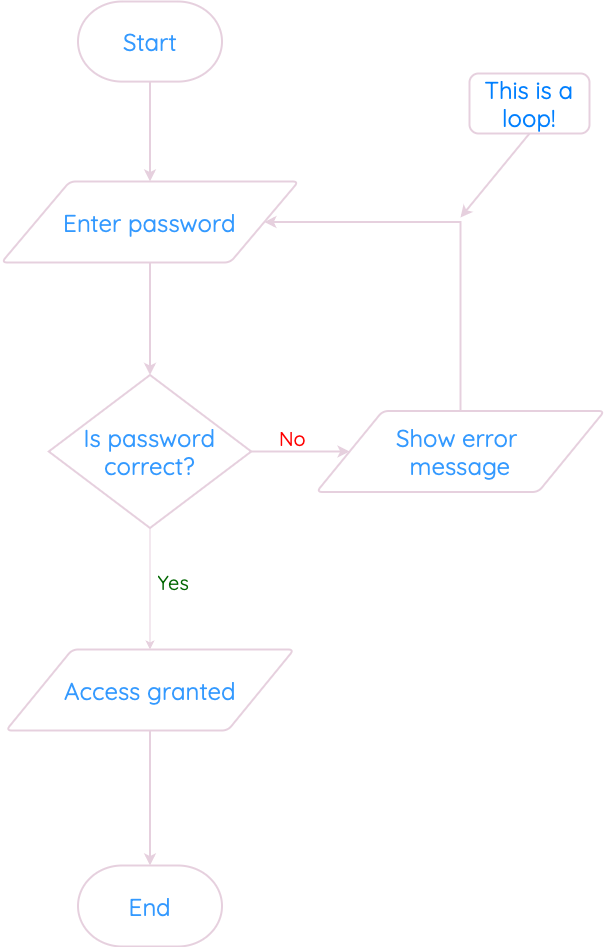

# Flowcharts

Flowcharts are used to show the sequence of steps in a program. We read the flowchart from top-to-bottom, following the arrows.

You can use a flowchart with any program, but they are good for clearly showing decisions and loops.

<figure markdown="span">
      { width="800" }
</figure>

    
Flowcharts don’t have a specific symbol for loops. Instead, they have to show a loop as a decision, with the arrows going up/backwards.

In this example, if the password is not correct, the program shows an error message, and then the arrow points back towards asking for the password again. 

This loop will continue until the user enters a correct password, breaking the loop.

<figure markdown="span">
      { width="350" }
</figure>

!!! info

      Some people prefer flowcharts to other notations, and others don’t. 
      
      According to the course spec, you should never be in a position where you have to draw a flowchart from scratch: you usually have a choice of at least two design notations (e.g. a flowchart or a structure diagram). 
      
      ==However, you do need to be able to read and understand a flowchart, and answer questions on one that you are given.==
